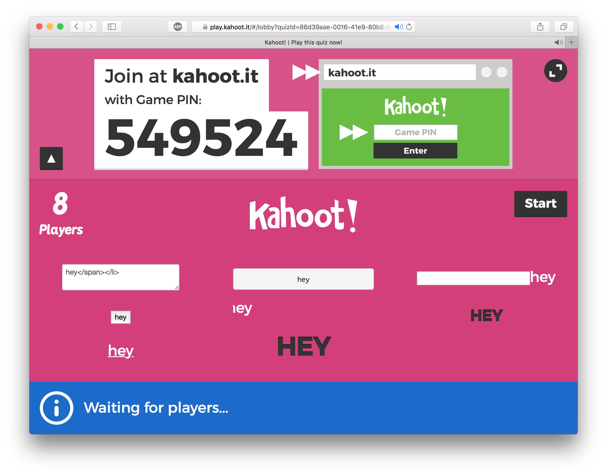

# Abstract

I have reverse engineered parts of the protocol used by [kahoot.it](http://kahoot.it). This repository contains the results of my labor.

For those of you who are not technically inclined, you can access a working version of these tools on the web at [hackkahoot.xyz](http://hackkahoot.xyz).

# Included tools

Currently, I have implemented the following tools:

 * [kahoot-flood](kahoot-flood/) - using an old school denial of service technique, this program automatically joins a game of kahoot an arbitrary number of times. For instance, you can register the nicknames "alex1", "alex2", ..., "alex100".
 * [kahoot-rand](kahoot-rand/) - connect to a game an arbitrary number of times (e.g. 100) and answer each question randomly. If you connect with enough names, one of them is bound to win.
 * [kahoot-play](kahoot-play/) - play kahoot regularly&mdash;as if you were using the online client.
 * [kahoot-html](kahoot-html/) - I have notified Kahoot and they have fixed this issue. It used to allow you to join a game of kahoot a bunch of times with HTML-rich nicknames. This messes with the lobby of a kahoot game. See the screenshot in the [example](#example) section.
 * [kahoot-crash](kahoot-crash/) - trigger an exception on the host's computer. This no longer prevents the game from functioning, so it is a rather pointless "hack"

# Dependencies

First, you must have [the Go programming language](https://golang.org/doc/install) installed on your machine.

Once you have Go installed and a `GOPATH` configured, you can use the following command to install the dependencies:

    go get github.com/gorilla/websocket

# Usage

Once you have all the needed dependencies, you can run [kahoot-flood/main.go](kahoot-flood/main.go) program to execute the kahoot-flood tool. You can run the other tools in a similar fashion.

# Example

